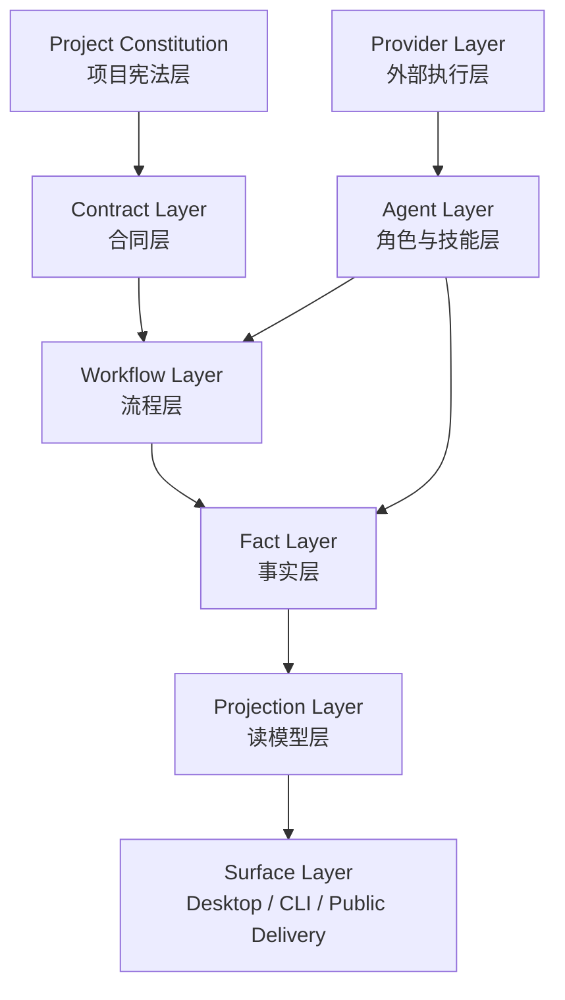

# 001 - Project Operating System V1

创建日期：2026-06-18
执行者：Codex

## Purpose

本文定义 AgentFlow 的底层总蓝图。

目标不是描述某个页面或某个 Agent 功能，而是定义一套可以长期演进的项目运行时：

- Project 是最高聚合根；
- Contract 是执行 authority；
- Workflow 负责控制流；
- Agent 负责执行流；
- Event Store 保存事实历史；
- Projection 提供 UI 只读视图；
- Provider、页面、外部会话都属于可替换层。

## 核心结论

AgentFlow 不是聊天驱动的多 Agent 外壳。
AgentFlow 是一个以 Project 为中心的运行时系统。

它的核心主链是：

```text
Requirement
-> Goal / Plan / Decisions
-> SpecProject / SpecIssue
-> Project Flow
-> Work Flow
-> Audit Flow
-> Delivery Flow
-> Goal Recheck / Completion
```

## 顶层原则

1. Project 是最高聚合根。
2. Agent 不是 authority，Contract 才是 authority。
3. Workflow 推进状态，不由 Agent 自己改状态。
4. Event 是唯一历史真相。
5. Projection 是 Desktop / CLI / 其他 Surface 的唯一读入口。
6. Provider 只能做适配层，不能持有业务 authority。
7. 本地运行事实和公开交付记录必须分层。
8. 任何 Agent / Provider / Surface 都必须可替换。

## 顶层结构



## 项目宪法层

项目宪法层回答“这个项目作为一个长期对象，到底由什么构成”。

核心对象：

- Project
- Goal
- Plan
- Decision
- SpecProject
- SpecIssue
- Audit Result
- Delivery Result
- Completion Decision

这里的任何对象都不依赖某个特定 Agent 或某个特定 Provider。

## 合同层

合同层是后续执行的唯一授权来源。

主要内容：

- `docs/requirements/**`
- `.agentflow/spec/projects/**`
- `.agentflow/spec/issues/**`
- workflowRef
- acceptance criteria
- evidence boundary
- allowedPaths / forbiddenPaths

规则：

- 没有 contract，就没有后续执行 authority。
- Agent 不能绕过 contract 自行扩大 scope。
- 审计和交付都必须回到 contract 对齐。

## 流程层

流程层负责控制流，而不是执行具体业务动作。

AgentFlow 至少存在四类流程：

- Project Flow
- Work Flow
- Audit Flow
- Delivery Flow

其中：

- Project Flow 是项目级编排层；
- Work Flow 是单任务执行状态机；
- Audit Flow 是独立审计状态机；
- Delivery Flow 是交付整理状态机。

## 事实层

事实层保存“发生了什么”，不负责直接渲染页面。

事实层由以下内容构成：

- Event Store
- Task Artifacts
- Audit Facts
- Release Facts

规则：

- 所有运行结果都必须先变成事实，再被投影。
- 事实是 append-only 的，不依赖页面当前是否打开。

## 读模型层

Projection / State 负责把底层事实变成可读视图：

- 任务时间线
- 项目摘要
- 当前状态
- Blockers
- Next Actions
- 审计摘要
- 交付摘要

规则：

- UI 只能读 Projection / State。
- UI 不直接读 provider session 文件、临时 run 文件或散落的内部事实。

## Agent 层

Agent 是角色执行器，不是系统 authority。

第一版角色：

- Goal Agent
- Spec Agent
- Work Agent
- Audit Agent
- Delivery Agent

Agent 的职责是：

- 在某个流程阶段执行被授权动作；
- 产出事件、证据或结果；
- 把结果交回 runtime，而不是自己改业务真相。

## Provider 层

Provider 只是外部执行载体，例如：

- Codex
- Claude Code
- future MAF adapter
- 其他 MCP provider

Provider 负责：

- session create / poll / cancel / logs
- 工具接入
- 外部能力适配

Provider 不负责：

- 任务排序
- 业务状态 authority
- 项目级判断

## Surface 层

Surface 是产品表面，可替换。

包括：

- Desktop / Tauri
- CLI
- Browser Preview
- Public Delivery Surface

Surface 只消费 Projection，不拥有底层 authority。

## 本地与公开交付边界

本地 `.agentflow/` 只保存内部运行事实：

```text
.agentflow/spec/**
.agentflow/events/**
.agentflow/tasks/<issue-id>/runs/**
.agentflow/tasks/<issue-id>/evidence/**
.agentflow/audit/**
.agentflow/projections/**
```

公开交付记录不写回 `.agentflow/tasks/<issue-id>/delivery/**`，而是进入：

- PR / MR body
- `CHANGELOG.md`
- release notes
- public delivery summary

## 永久层与可替换层

### 尽量长期稳定的永久层

- Project Constitution
- Contract Layer
- Workflow Layer
- Fact Layer
- Projection Layer

### 允许迭代替换的可替换层

- Agent role implementation
- Skill packs
- Provider adapters
- Desktop / CLI / Web surface
- Prompt / session profile

## 与当前 crates 的映射

当前代码可以映射到这套蓝图：

- `spec` -> Contract Layer
- `panel` -> Context / Fact Support Layer
- `workflow-core` -> Workflow Definition Layer
- `workflow-runtime` -> Workflow Execution Layer
- `event-store` -> Fact Layer
- `projection` / `state` -> Projection Layer
- `agent-dispatcher` -> Agent / Provider Bridge
- `mcp` -> Provider Layer
- `task-artifacts` -> Fact Layer
- `audit` -> Audit Fact / Result Layer
- `release` -> Public Delivery Layer

## 不做事项

- 不把自由聊天或 group chat 作为主流程 authority。
- 不让 Agent 自己决定项目状态。
- 不让 UI 刷新直接驱动业务流程。
- 不让 provider session 成为业务真相源。
- 不把本地 runtime 证据和公开交付记录混在一起。

## 后续落地顺序

1. 先固定 Agent Capability Matrix。
2. 再固定 Workflow Schema。
3. 再固定 Event / Projection 模型。
4. 最后再回到 crates 和页面实现收口。
